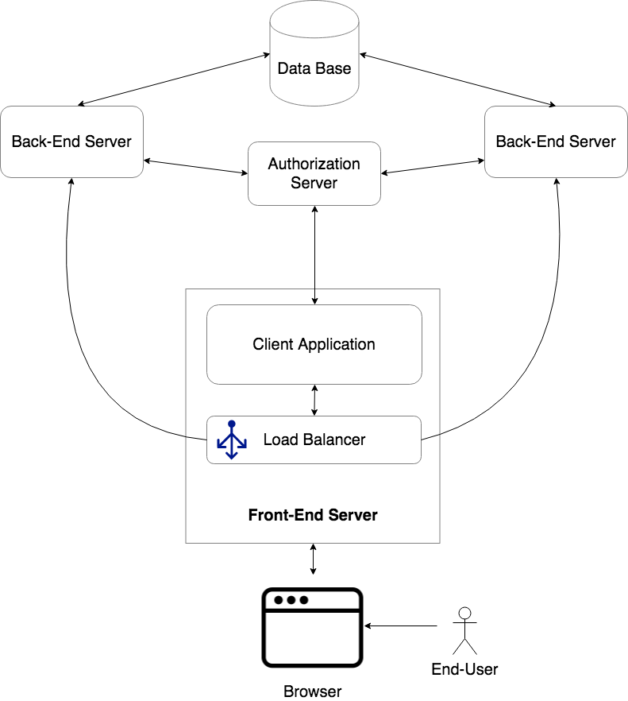

:toc:

= DAW Project

.Architecture

== Back-End Server

Este servidor contém uma instância da API realizada na primeira fase. Esta API consiste numa aplicação Spring Boot RESTful que irá fornecer informações sobre checklists através de pedidos HTTP.

== Data Base

Servidor responsável por garantir a persistência de dados da aplicação servidora back-end. Esta componente utiliza base de dados PostgreSQL.

== Authorization Server

Este servidor é responsável pela autêntificação do utilizador. Contem uma instância MitreIdConnect. Comunica com o back-end e com o client application.

== Front-End Server
=== Load Balancer
=== Client Application

== Tomcat Babysitting